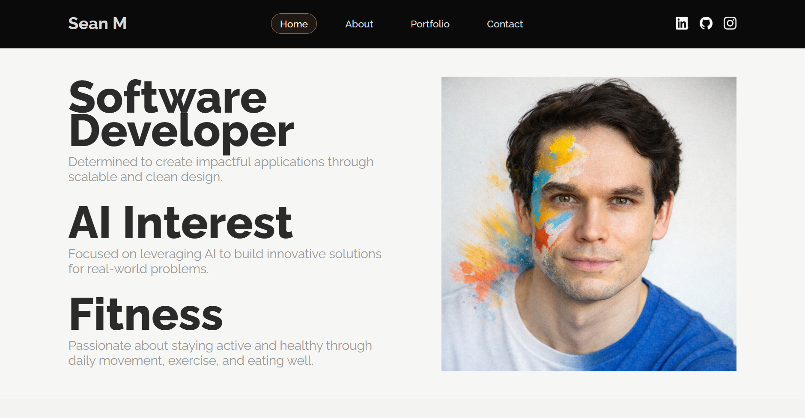
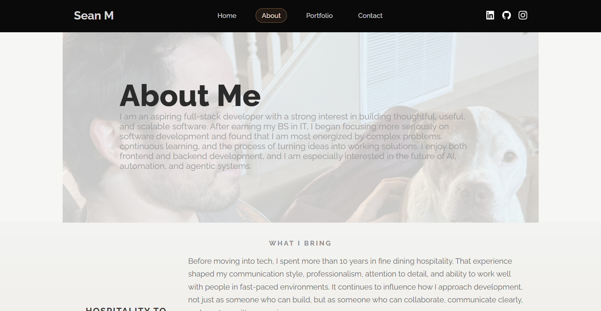
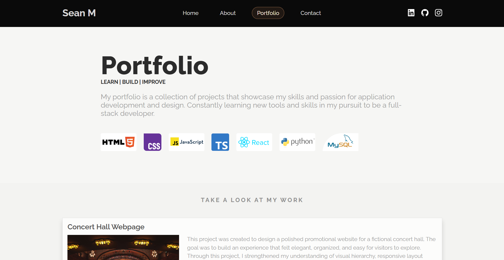
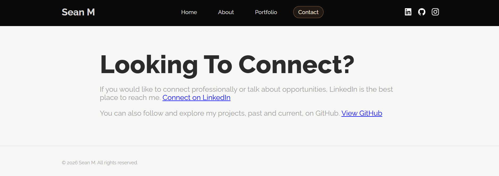

# Personal Landing Page Portfolio
This project is a personal landing page designed to showcase my background, skills, and development work. It serves as a central hub for my portfolio, highlighting both my technical abilities and my approach to building thoughtful, user-focused applications.

## Overview
The site is structured as a multi-page static website built with HTML and CSS. It focuses on clean design, clear navigation, and strong visual presentation while maintaining responsiveness across devices.

The goal of this project is to create a professional online presence that communicates, who I am, what I build, how I think as a developer, and where to find and connect with me.

## Pages

### Home

The homepage introduces my core interests and focus areas:
- Software Development
- AI and emerging technologies
- Health and fitness

### About

The About page provides a deeper look into my background, transition into tech, and development mindset:
- My journey from hospitality to software development
- My interest in full-stack and AI-driven systems
- My approach to collaboration, growth, and problem-solving

### Portfolio

The Portfolio page showcases detailed project work, including:
- Concert Hall Webpage (HTML, CSS, JavaScript)
- Dungeons & Dragons Character Creator (React, TypeScript)
- Gym Management System (Python, MySQL)
- Money Math Tool (Python)
- Dungeon Dice Roller (Python, React)

### Contact

The Contact page provides direct access to my professional platforms:
- LinkedIn for networking and opportunities
- GitHub for project exploration

## Tech Stack
- HTML5
- CSS3
- Google Fonts (Raleway)

The styling focuses on:
- Clean layout and spacing
- Consistent typography
- Responsive design using media queries

## Features
- Multi-page navigation structure
- Responsive design across desktop, tablet, and mobile
- Project showcase with descriptions and technologies used
- Social media integration (LinkedIn, GitHub, Instagram)
- Clean and minimal UI with a professional aesthetic

## Project Structure
/project-root
│── index.html
│── about.html
│── portfolio.html
│── contact.html
│── style.css
│── /images
│── /screenshots

## Purpose
This project represents my growth as a developer and serves as a foundation for future expansion. It reflects my focus on building:
- Clean, scalable interfaces
- User-centered designs
- Practical applications with real-world relevance

## Future Improvements
- Add JavaScript interactivity and animations
- Integrate a backend for contact form functionality
- Expand portfolio with additional full-stack and AI projects

## How to Open the Project
1. Download or clone the repository:
git clone https://github.com/Sean-MacNabb/Personal_Landing_Page_Assignment.git
2. Navigate into the project folder
3. Open index.html in your browser

## Author
Sean M  
- LinkedIn: https://www.linkedin.com/in/sean-macnabb/
- GitHub: https://github.com/Sean-MacNabb